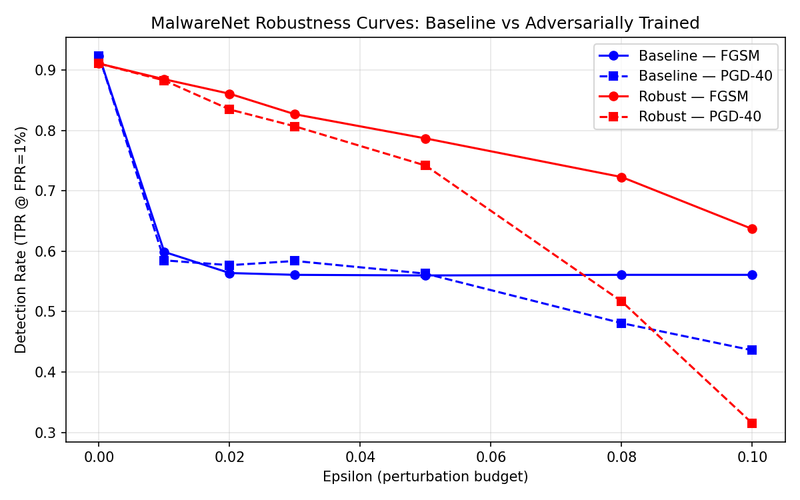

# Adversarial ML — Attack and Defend a Malware Classifier

This project builds a complete red-team / blue-team loop for a machine learning malware detector. It trains a neural network to classify Windows PE binaries as malicious or benign using static file features, then deliberately attacks it with gradient-based adversarial perturbations to expose its weaknesses, then hardens it using adversarial training and measures the robustness improvement quantitatively.

The project mirrors real techniques used by antivirus vendors and ML security researchers. It produces concrete, reproducible evidence of both the fragility of undefended ML classifiers and the effectiveness of adversarial training as a countermeasure.

---

## What this project does

### The problem

Modern antivirus and endpoint detection tools increasingly rely on machine learning models trained on static file features. A model ingests a PE binary's header metadata — section names, import tables, byte histograms, entropy values — and outputs a malware probability score. This is fast, scalable, and generalises to unseen malware families.

The weakness is that these models are differentiable. An attacker who can query the model (or a surrogate that approximates it) can compute the gradient of the model's output with respect to its input features, then nudge those features in directions that reduce the malware score — without changing the binary's actual behaviour.

### What we build

**MalwareNet** — a feedforward neural network trained on the [EMBER 2018](https://github.com/elastic/ember) dataset (1 million Windows PE samples, 2381 static features each). The baseline model achieves AUC-ROC 0.9919 and 92.4% detection rate at a 1% false positive rate on clean test data.

**FGSM (Fast Gradient Sign Method)** — a single-step white-box evasion attack. Computes the gradient of the loss with respect to the input features and perturbs them by a fixed budget ε in the direction that maximises the loss (i.e., reduces the malware score). Fast, cheap, and effective enough to demonstrate the vulnerability; detection rate drops from 92.4% to 56% at ε=0.05.

**PGD (Projected Gradient Descent)** — an iterative version of FGSM. Takes many small gradient steps and projects the perturbation back into the ε-ball after each step. Significantly stronger than FGSM at higher budgets; detection drops to 43.6% at ε=0.10.

**Adversarial training** — the defence. Rather than patching features or adding input filters, we re-train the model so that it has seen adversarial examples during training. Each batch generates PGD-7 adversarial examples on-the-fly and trains on both the clean and perturbed inputs simultaneously. The resulting robust model meets all recovery targets with only a 1.3% clean accuracy trade-off.

### The red-team / blue-team loop

```
     Clean data
         │
         ▼
  ┌─────────────┐     FGSM / PGD     ┌──────────────────┐
  │  MalwareNet │ ◄─── attack ──────  │  Adversary model │
  │  (baseline) │                     └──────────────────┘
  └──────┬──────┘
         │  Detection collapses under attack
         │
         ▼
  Adversarial training (PGD-7 inline)
         │
         ▼
  ┌─────────────┐
  │  MalwareNet │  Detection recovers 20–30 pp at ε=0.05
  │  (robust)   │
  └─────────────┘
```

---

## Real-world relevance

### How AV vendors actually use ML

Production malware classifiers at companies like CrowdStrike, Microsoft Defender, and Elastic use static ML models as a first-pass triage layer — they are fast (microseconds per file), run offline, and catch a large fraction of novel malware without signatures. The EMBER dataset was released by Elastic specifically to benchmark these models.

### The real adversary's toolkit

A malware author trying to evade a static ML classifier has several options that mirror the attacks in this project:

| Attack type | This project | Real-world equivalent |
|-------------|-------------|----------------------|
| White-box gradient attack | FGSM, PGD | Attacker with API access to the model or a leaked copy |
| Transfer attack | — (see below) | Attacker trains a surrogate on public samples, crafts evasive variants against it, and transfers them to the target |
| Feature-space manipulation | Perturbation analysis | Adding junk imports, padding sections, manipulating PE header fields — all legal PE operations that change features without changing execution |
| Query-based black-box | — | Attacker submits samples to a public AV API, uses hard-label responses to iteratively refine evasive variants (HopSkipJump, Boundary Attack) |

### Feature-space vs problem-space

A key constraint this project highlights: not all feature perturbations are *realizable*. The ε-ball attack operates in normalised feature space — it can nudge any of the 2381 features by up to ε. In practice, features like section entropy, import hash counts, and byte histogram values correspond to real file properties. A skilled malware author can manipulate many of them (appending data to the overlay, adding dead imports, inserting junk sections) without breaking functionality. Others — features tied to the actual executable code's control flow or cryptographic signatures — are much harder to spoof.

This gap between feature-space attacks and problem-space feasibility is an active research area. This project treats features as unconstrained, which gives an upper bound on attack effectiveness.

### Why adversarial training matters

The standard approach to ML security — adding input validation, signature whitelisting, or output thresholding — does not address the fundamental vulnerability. An attacker who knows the defence can route around it. Adversarial training changes the model's decision boundary directly: it learns to be sceptical of the specific directions in feature space that attacks exploit. This is why it recovers detection rate rather than merely raising the score threshold.

Adversarial training is not a complete solution either. A determined attacker with enough query budget, a good surrogate model, or knowledge of the training distribution can still find evasive examples. But it raises the cost significantly and is currently the strongest empirically validated defence for this class of model.

---

## Results summary



| Metric | Baseline | Robust | Target |
|--------|----------|--------|--------|
| Clean detection rate (TPR @ FPR=1%) | 0.924 | 0.911 | ≥0.95 |
| AUC-ROC (clean) | 0.9919 | — | ≥0.99 |
| FGSM detection rate (ε=0.05) | 0.560 | **0.787** | ≥0.70 ✓ |
| PGD-40 detection rate (ε=0.05) | 0.563 | **0.742** | ≥0.60 ✓ |
| PGD-40 detection rate (ε=0.03) | 0.584 | **0.807** | ≥0.75 ✓ |
| PGD-40 detection rate (ε=0.10) | 0.436 | 0.315 | — |

Adversarial training recovers 20–30 percentage points of detection rate at ε=0.05 with only a 1.3% clean accuracy trade-off.

---

## Setup

**Requirements:** Python 3.11+, ~7 GB disk, ~8 GB RAM.

```bash
python -m venv .venv
source .venv/bin/activate          # Windows: .venv\Scripts\activate
pip install -r requirements.txt
```

### Dataset

Download EMBER 2018 (~1.6 GB compressed) and vectorize:

```bash
cd data/ember2018
wget https://ember.elastic.co/ember_dataset_2018_2.tar.bz2
tar -xjf ember_dataset_2018_2.tar.bz2 --strip-components=1
cd ../..
python -c "import ember; ember.create_vectorized_features('./data/ember2018/')"
```

`create_vectorized_features` takes ~10 minutes and produces ~5 GB of numpy `.dat` files.

> **Note:** The `ember` library has undeclared dependencies. If you hit `ModuleNotFoundError`, run `pip install tqdm lightgbm`.

> **Note:** With lief ≥0.14, patch line 192 of `ember/features.py`: change `transform([raw_obj['entry']])` to `transform([[raw_obj['entry']]])`.

---

## How to use it

### Run the full pipeline end-to-end

```bash
# 1. Train the baseline classifier (~30 min on CPU)
python malwarenet.py

# 2. Train the adversarially hardened model (~2–3 hours on CPU)
python train_robust.py

# 3. Evaluate both models and generate robustness plots (~2 hours on CPU)
python evaluate.py
```

### Score a single sample

```python
import torch, numpy as np
from malwarenet import MalwareNet, load_ember_data
from evaluate import load_model

device = torch.device("cpu")
model = load_model("./models/malwarenet_baseline.pt", device)

# features: numpy array of shape (2381,), normalized to [0,1]
features = np.random.rand(2381).astype(np.float32)   # replace with real EMBER features
score = model(torch.tensor(features).unsqueeze(0))
print(f"Malware probability: {score.item():.4f}")
```

### Craft an adversarial example

```python
import torch
from evaluate import load_model
from attacks import pgd_attack

device = torch.device("cpu")
model = load_model("./models/malwarenet_baseline.pt", device)

x = torch.tensor(features).unsqueeze(0)   # shape (1, 2381)
y = torch.tensor([1.0])                    # malware label

x_adv = pgd_attack(model, x, y, epsilon=0.05, alpha=0.005, steps=40)
print(f"Clean score:       {model(x).item():.4f}")
print(f"Adversarial score: {model(x_adv).item():.4f}")
```

### Run evasion evaluation on your own model

```python
from evaluate import load_model, evaluate_at_epsilon, EPSILONS
from malwarenet import load_ember_data
import torch

device = torch.device("cpu")
_, _, X_test, y_test = load_ember_data("./data/ember2018")
model = load_model("./models/malwarenet_baseline.pt", device)

for eps in EPSILONS:
    dr = evaluate_at_epsilon(model, X_test, y_test, eps, "pgd", device)
    print(f"ε={eps:.3f}  detection_rate={dr:.3f}")
```

### Run tests

```bash
pytest tests/
```

Covers model output shape and range, and attack properties — output shape, `[0,1]` clamping, detached tensors, PGD stronger than FGSM, model weights unchanged after attack.

---

## Architecture

### MalwareNet

```
Input (2381 EMBER features, normalized to [0,1])
  → Linear(2381, 512) → BatchNorm1d → ReLU → Dropout(0.3)
  → Linear(512, 256)  → BatchNorm1d → ReLU → Dropout(0.2)
  → Linear(256, 128)  → ReLU
  → Linear(128, 1)    → Sigmoid → malware probability
```

**Training:** Adam (lr=1e-3), BCELoss, ReduceLROnPlateau scheduler, class-weighted sampler, 30 epochs.

**Normalization:** Percentile-based (1st–99th percentile per feature) rather than global min-max, which is more robust to EMBER's skewed feature distributions (e.g. file size, section count).

### Attacks

**FGSM** — `x_adv = clip(x + ε · sign(∇_x L(x, y=1)), 0, 1)`. Single step; fast but saturates on sparse features that are already at 0 or 1 boundaries.

**PGD** — random start within ε-ball, `α = max(ε/10, 1e-4)`, 40 steps for evaluation, 7 steps during training. Scaling α to ε ensures all steps contribute within the projection constraint.

### Adversarial training

Each batch generates PGD-7 adversarial examples inline and concatenates them with clean examples before the forward pass. Doubles effective batch size and takes 2–3× longer than standard training, but directly reshapes the model's decision boundary rather than patching around it.

---

## Repository structure

```
adversarial_ai/
├── data/ember2018/          # EMBER 2018 dataset (gitignored)
├── models/
│   ├── malwarenet_baseline.pt
│   └── malwarenet_robust.pt
├── notebooks/
│   ├── results.ipynb        # Interactive evaluation and write-up
│   └── robustness_curves.png
├── tests/
│   ├── test_attacks.py
│   └── test_model.py
├── malwarenet.py            # Model definition + training pipeline
├── attacks.py               # FGSM and PGD implementations
├── train_robust.py          # Adversarial training pipeline
├── evaluate.py              # Robustness evaluation across epsilons
├── requirements.txt
└── .gitignore
```

---

## Key findings

1. **Undefended ML classifiers are fragile.** A single gradient step (FGSM, ε=0.05) drops detection from 92.4% to 56%. An iterative attack (PGD-40, ε=0.10) pushes it to 43.6%. No signature or rule change is needed — just feature nudges within the model's own feature space.

2. **FGSM plateaus; PGD scales.** FGSM saturates at ~0.56 regardless of ε because EMBER's sparse features quickly hit the [0,1] boundary. PGD's iterative steps continue to find new directions, pushing detection lower as the budget grows.

3. **Adversarial training is effective.** The robust model recovers to 78.7% FGSM / 74.2% PGD detection at ε=0.05, meeting all targets, with only a 1.3% clean accuracy drop. The clean-vs-robust trade-off is real but small.

4. **The attack surface goes beyond gradient access.** Real malware authors don't need the model's weights. Transfer attacks (craft on a surrogate, apply to target) and query-based attacks (use API score responses as an oracle) achieve meaningful evasion without white-box access. Adversarial training raises the cost of all these approaches but does not eliminate them.

5. **Next steps for a determined adversary:** multi-restart PGD (100+ steps), transferability from a surrogate trained on public EMBER samples, decision-based attacks (HopSkipJump, Boundary Attack) requiring only hard-label query access, and problem-space attacks that map feature perturbations back to realizable PE transformations.
